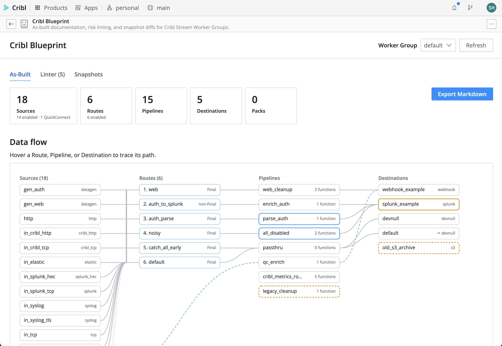
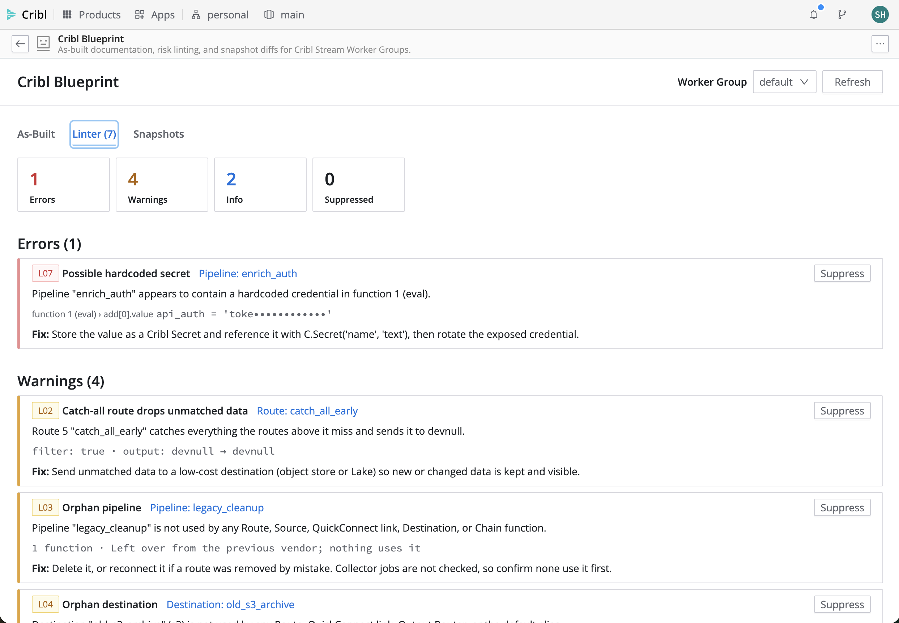
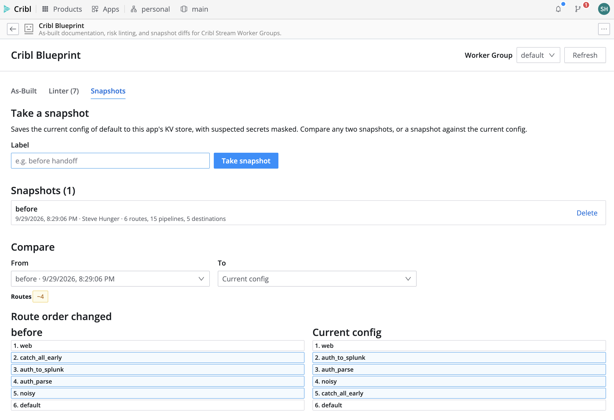

# Cribl Blueprint

Cribl Blueprint documents what is deployed in a Cribl Stream Worker Group, flags what in it is broken or risky, and keeps labelled snapshots so you can see what changed.

## Summary

Cribl Blueprint is a Cribl App for admins and consultants who inherit, audit, or hand off a Cribl Stream deployment. It generates an as-built report with a data-flow diagram and a Markdown export. It lints the configuration for risky patterns, such as silently dropped data, hardcoded secrets, and shadowed routes. It also keeps labelled snapshots, so a handoff or change review has a record of exactly what changed.



## What This App Does

* Primary purpose: as-built documentation and risk review for Cribl Stream Worker Groups.
* Key capabilities:
  * **As-Built.** Inventory of Sources, Routes (in evaluation order), Pipelines, Destinations, and Packs.
    * A Source → Route → Pipeline → Destination diagram that shows QuickConnect paths. Each object is outlined by its worst lint finding.
    * One-click Markdown export: a handoff document with a Mermaid flowchart, every table, and the findings.
  * **Linter.** Eight rules with severity, evidence, and a one-line fix. Findings can be suppressed with a reason, and suppressions persist for the whole team.
  * **L01 fix-it.** Reorders a shadowing route after a before/after preview and explicit confirmation. The change is left uncommitted for review.
  * **Snapshots.** Labelled point-in-time captures. Compare any two, or a snapshot against the current config, with route-order and field-level changes.
* Intended users: Cribl admins, platform owners, consultants.
* Works with: Cribl Stream on Cribl.Cloud.

### Lint rules

| ID | Rule | Severity |
|---|---|---|
| L01 | Route shadowing: a Final catch-all route hides the specific routes below it | Error |
| L02 | The first reachable Final catch-all route sends unmatched data to devnull | Warning |
| L03 | Orphan pipeline: referenced by no Route, Source, QuickConnect link, Destination, or Chain function | Warning |
| L04 | Orphan destination: referenced by no Route, QuickConnect link, Output Router, or the default alias | Warning |
| L05 | Destination drops events under backpressure | Warning |
| L06 | Pipeline does nothing (no functions, or all disabled) | Info |
| L07 | Possible hardcoded secret in a pipeline function; evidence shows at most 4 characters | Error |
| L08 | Regex starts with an unanchored `.*` | Info |

Blueprint complements [Config Quest](https://github.com/Cribl-Community/cc-di-configquest-for-cribl). Config Quest is a read-only browser and hygiene checker across groups. Blueprint focuses on the handoff document, risk rules, recorded suppressions, labelled snapshot diffs, and a confirmed fix-it.

## When To Use This App

* You inherit a Cribl deployment and need to know what is actually running.
* You are handing a deployment to a customer or another team and need an as-built document.
* Before and after a change window, to record exactly what changed.
* As a periodic risk review: dropped data, credentials in pipelines, dead config.

## Before You Install

* Required Cribl product or deployment type: Cribl Stream on Cribl.Cloud (Apps are Cribl.Cloud only). Tested on 4.20.1; minimum 4.18.0.
* Required permissions or roles:
  * Installing needs Organization Administrator.
  * Using the app needs read access to the Worker Group's config.
  * The optional L01 fix-it needs write access to Routes.
* Required external systems or APIs: none.
* Required configuration values: none.
* Known limits or prerequisites: see [Known Limitations](#known-limitations).

## Installation

### Install From Marketplace or URL
1. Go to **Apps** in your Cribl environment.
2. Choose the Marketplace or import from URL option.
3. If the app is available in the Cribl Marketplace, install it directly from there.
4. If the app is distributed as a Marketplace-hosted URL, use the URL to import it.
5. Review the app details, including the requested API permissions, and complete installation.

### If The App Is Not Yet In The Cribl Marketplace
1. Open the repository's **Releases** page.
2. Download `cc-shunger-1.0.2.tgz` (or the version you want).
3. In Cribl, go to **Apps > Add App > Import from File**.
4. Upload the `.tgz` file.
5. Review the app details and complete installation. No other steps are needed.

## Configuration

Blueprint has no settings. It reads the Worker Groups the signed-in user can see and needs no credentials, tokens, or proxy hosts.

| Setting | Required | Description | Example | Scope |
|---|---|---|---|---|
| (none) | — | — | — | — |

## How To Use

### Typical Workflow
1. Open **Cribl Blueprint** from the Apps page and pick a Worker Group.
2. **As-Built:** review the summary and diagram. Hover a Route, Pipeline, or Destination to trace its path. Click **Export Markdown** for the handoff document.
3. **Snapshots:** take a snapshot labelled, for example, "before".
4. **Linter:** review findings, highest severity first.
   * Click an object to see its details.
   * **Suppress** a finding with a reason when it is intentional.
   * On L01, **Fix it…** shows a preview before anything is written.
5. After changes, commit and deploy them in Cribl Stream as usual. Then compare the "before" snapshot with **Current config** on the Snapshots tab.





### First-Run Checklist
* Pick a Worker Group; the As-Built tab loads within a few seconds.
* If a yellow "Uncommitted changes" banner appears, the report includes edits that are not committed yet.
* Take a baseline snapshot before making changes.

## Permissions

Every API call runs as the signed-in user, with that user's own Cribl permissions, through the Apps platform's proxy. Blueprint never sees or stores tokens.

* **Core (read-only):** the Worker Group list and the five config collections below.
* **Optional (write):** reordering a group's Routing table for the L01 fix-it. It only runs after the user clicks **Fix it…**, reviews the preview, and confirms. The change is saved as uncommitted config; Blueprint never commits or deploys.
* **If access is denied:**
  * A group that can't be read shows an error with Retry.
  * If Packs can't be read, the report continues without them and shows a warning.
  * A failed fix-it write leaves the Routing table unchanged and shows the error.

### Cribl API Endpoints Used

| Method | Endpoint | Purpose |
|---|---|---|
| GET | `/api/v1/master/groups?product=stream&fields=git.localChanges` | List Stream Worker Groups and their uncommitted-change count |
| GET | `/api/v1/m/{group}/routes` | Routing table, in evaluation order |
| GET | `/api/v1/m/{group}/pipelines` | Pipelines and their functions (also lists packs as `pack:<id>`) |
| GET | `/api/v1/m/{group}/system/inputs` | Sources, including QuickConnect connections |
| GET | `/api/v1/m/{group}/system/outputs` | Destinations, backpressure settings, and the `default` alias |
| GET | `/api/v1/m/{group}/packs` | Installed packs |
| PATCH | `/api/v1/m/{group}/routes/{id}` | L01 fix-it only: write the reordered Routing table after confirmation |
| GET, PUT, DELETE | `/api/v1/a/cc-shunger/kvstore/*` | App-scoped KV store for snapshots and suppressions (granted automatically) |
| POST | `/api/v1/a/cc-shunger/kvstore/keys` | List snapshot keys by prefix |

## External API Access

Blueprint makes no external calls.

### Default Configuration
* `default/proxies.yml`: empty. No proxy hosts are declared.
* `default/policies.yml`: GET on the endpoints above, plus PATCH on `/m/:gid/routes/*` for the fix-it.
* `default/schedules.yml`: empty. There are no scheduled jobs and no backend functions.

### External Endpoints
* None.

## Data And Storage

Blueprint stores only its own data, in the app's KV store:

| KV key | Contents |
|---|---|
| `snapshot/<group>/<id>/meta` | Snapshot label, time, author, object counts |
| `snapshot/<group>/<id>/chunk/<n>` | The snapshot's normalized config as JSON, split into chunks under 90 KB |
| `suppress/<group>` | Suppressed findings: finding key, reason, author, date |

* **No secrets are stored.** Before a snapshot is saved, anything the L07 detector flags is replaced by its first 4 characters plus a short fingerprint. KV encryption is therefore not needed.
* **Shared.** KV data is shared by everyone who uses the app in the workspace, which makes suppressions a team decision.
* **Deleted with the app.** Uninstalling the app deletes its KV data. Upgrading keeps it.
* **Quota.** Each snapshot uses 1 key plus about 1 key per 90 KB of config. The default quota is 1,000 keys per app, so delete old snapshots from the Snapshots tab if you approach it.

## Support

### Partner Built
This app is built by Steve Hunger (Presidio) for the CriblCon 2026 App Hackathon, Partner track. It carries no official Cribl support commitment. Report issues and feature requests on the repository's GitHub Issues page.

## Known Limitations

* Stream Worker Groups only. Edge Fleets and Search are out of scope.
* Collector jobs are not read, so a pipeline used only by a Collector is reported as an orphan (L03). The fix text says so.
* L04 stands down entirely when any enabled route uses an output expression, since any destination could be chosen at runtime. The Linter tab explains why.
* Routes inside packs are not analyzed; packs appear as pack references.
* L07 is a heuristic. It can miss secrets, and it can flag random-looking literals that aren't secrets. Suppress false positives with a reason.
* Snapshots and suppressions made in Live Preview (development) are stored separately from the installed app's.

## Troubleshooting

### The App Opens But Some Features Do Not Work
* **"Couldn't load config":** the signed-in user may lack read access to that Worker Group. Check their Stream role.
* **The fix-it fails:** the user needs write access to Routes. The Routing table is unchanged when this happens.
* **"The Routing table changed since Blueprint loaded it":** someone edited routes in the meantime. Click **Refresh** and try again.

### The App Cannot Connect To An API Or Service
Blueprint only calls the Cribl API of the workspace it runs in. If every call fails, check that Apps are enabled (**Settings > Global Settings > App Settings**) and that the app is shared with the user.

### The App Works Locally But Not In Cribl
Live Preview uses the developer's session and a separate KV store (`__dev__cc-shunger`). An installed app only gets the paths declared in `config/policies.yml`, so a new API call must be added there too.

## Development

```bash
npm install
npm run dev        # then open Apps > Create App > Live Preview (App ID cc-shunger) in Cribl
npm test           # unit tests: model, rules, report, diff, store, fix-it
npm run package    # build/cc-shunger-<version>.tgz
```

* The rule engine, report builder, diff, and fix planner are pure TypeScript with no Cribl calls. They are tested offline against sanitized fixtures from real workspaces (`test/fixtures/`).
* Live Preview has a dev-only **Show dev tools** panel, excluded from production builds. It has a raw-config downloader for fixtures and the demo seeder (`demo/SEED.md`).
* `AGENTS.md` is the Cribl App platform guide from the scaffold. `DECISIONS.md` records every non-obvious choice. `BUILD_PLAN.md` is the build plan.

## Project Layout

```text
src/
  api/        fetch wrappers: groups, config collections, route reorder (the only write)
  model/      raw API JSON -> Inventory; reference graph; redaction; built-in pipelines
  lint/       rule runner + one file per rule (rules/L01.ts … L08.ts)
  report/     As-Built view model, diagram layout, Markdown export
  diff/       Inventory x Inventory -> ChangeSet
  fix/        L01 fix planner
  store/      KV client, snapshots, suppressions
  ui/         tabs, diagram, drawers, modals
  dev/        Live Preview-only tools (excluded from builds)
config/
  policies.yml   Cribl API access grants
  proxies.yml    external domains (none)
  schedules.yml  scheduled functions (none)
demo/
  seed.ts      the demo group's deliberately broken config (also the "bad" test fixture)
  SEED.md      how to rebuild the demo
test/fixtures/ sanitized Inventory fixtures
LICENSE  CREDITS.md  DECISIONS.md  BUILD_PLAN.md
```

## Versioning And Releases

* Semantic versioning. `npm run package` bumps the patch version; use `-- --minor`, `-- --major`, or `-- --version X.Y.Z` to choose.
* Each GitHub release attaches the exact `.tgz` that passed the clean-install test.
* Upgrading keeps snapshots and suppressions (KV data is preserved on upgrade).

## Contributing

Open an issue describing the change first. Pull requests should keep the rule engine and report builder free of Cribl calls, and include a firing and a non-firing test for any rule change.

## Credits And AI Disclosure

* Built during the hackathon window starting September 14, 2026.
* Written with **Claude Code** (Anthropic), reviewed by the author. See [CREDITS.md](./CREDITS.md) for every library and reference used.

## License

This app is licensed under the Apache License 2.0; see [LICENSE](./LICENSE). The UI bundles Cribl's Capra design system, which Cribl provides to App builders under the [Cribl Developer Agreement](https://cribl.io/legal/packs-developer-agreement/); see CREDITS.md.

## App Metadata

Use this table as the canonical source for gallery fields. Keep the left column labels exactly as written.

| Field | Value |
|---|---|
| App Name | Cribl Blueprint |
| App ID | cc-shunger |
| Version | 1.0.1 |
| Author | Steve Hunger (Presidio) |
| Support Model | partner-built |
| Support Label | Partner Built |
| Support Contact | https://github.com/Cribl-Community/cc-shunger/issues |
| License | Apache-2.0 |
| License File | [Apache License 2.0](https://www.apache.org/licenses/LICENSE-2.0.txt) |
| Product Tags | stream |
| Category | Configuration management |
| Audience | admin, platform-owner |
| Availability | preview |
| Requires External Access | no |
| Repository | https://github.com/Cribl-Community/cc-shunger |
| Documentation | https://github.com/Cribl-Community/cc-shunger#readme |
| README Schema Version | 1.0 |
